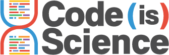

<!-- ALL-CONTRIBUTORS-BADGE:START - Do not remove or modify this section -->

<!-- ALL-CONTRIBUTORS-BADGE:END -->

 

# Code is science!

Code is Science works with the scientific coding community to champion Open Source code, so we can ensure that code is peer reviewed and [FAIR](https://www.nature.com/articles/sdata201618).

For more details about our mission see [CodeIsScience.com](http://www.codeisscience.com). If you'd like to **contribute** (including Mozilla Global Sprint volunteers!), head to [CONTRIBUTING.md](CONTRIBUTING.md) or straight to our [issues list](https://github.com/yochannah/code-is-science/issues)! PS, have I mentioned how awesome you are for considering it? :heart-eyes:

## Contact
New: we have a [gitter room](https://gitter.im/codeisscience/Lobby#)!

## Roadmap
This is primarily managed as a list of tickets in a [GitHub project board](https://github.com/yochannah/code-is-science/projects/1), but here's a quick rough list:

### Short term
  - Design tasks - head to our [logos repo](https://github.com/codeisscience/logos/issues/) - we'd like logos to represent all scientific disciplines!

### Medium term
- begin technical development of journal database, including [db component](https://github.com/yochannah/code-is-science/issues/5), [api](https://github.com/yochannah/code-is-science/issues/7), [ui](https://github.com/yochannah/code-is-science/issues/9), and [search](https://github.com/yochannah/code-is-science/issues/8)

### Tasks for anywhen
- add to the "db" of journals that do (or don't) require an open source licence. Currently a google sheet: https://docs.google.com/spreadsheets/d/1oY5ak7VJa-qwJJeWA3829S-1akZaYtHuWPYpChBdW2o/edit#gid=1946180293

## Contributors ✨

Thanks goes to these wonderful people ([emoji key](https://allcontributors.org/docs/en/emoji-key)):

<!-- ALL-CONTRIBUTORS-LIST:START - Do not remove or modify this section -->
<!-- prettier-ignore-start -->
<!-- markdownlint-disable -->
<table>
  <tr>
    <td align="center"><a href="http://rgaiacs.com"> <b>Raniere Silva</b></a></td>
    <td align="center"><a href="https://github.com/JPTIZ"> <b>João Paulo Taylor Ienczak Zanette</b></a></td>
    <td align="center"><a href="https://ikayz.github.io/"> <b>Isaac Miti</b></a></td>
    <td align="center"><a href="https://github.com/Fnyasimi"> <b>Fnyasimi</b></a></td>
    <td align="center"><a href="http://biomake.space"> <b>Abigail Wood</b></a></td>
    <td align="center"><a href="https://github.com/delwen"> <b>Delwen Franzen</b></a></td>
    <td align="center"><a href="http://twitter.com/dipanshunagar"> <b>Dipanshu Nagar</b></a></td>
  </tr>
  <tr>
    <td align="center"><a href="http://twitter.com/emmy_ft"> <b>Emmy Tsang</b></a></td>
    <td align="center"><a href="https://github.com/helenapv"> <b>helenapv</b></a></td>
  </tr>
</table>

<!-- markdownlint-enable -->
<!-- prettier-ignore-end -->
<!-- ALL-CONTRIBUTORS-LIST:END -->

This project follows the [all-contributors](https://github.com/all-contributors/all-contributors) specification. Contributions of any kind welcome!

## Credits 

### Backers

Thank you to all our backers! 🙏 [[Become a backer](https://opencollective.com/code-is-science#backer)]

### Sponsors

Support this project by becoming a sponsor. Your logo will show up here with a link to your website. [[Become a sponsor](https://opencollective.com/code-is-science#sponsor)]

## Contributors ✨

Thanks goes to these wonderful people ([emoji key](https://allcontributors.org/docs/en/emoji-key)):

<!-- ALL-CONTRIBUTORS-LIST:START - Do not remove or modify this section -->
<!-- prettier-ignore-start -->
<!-- markdownlint-disable -->
<table>
  <tr>
    <td align="center"><a href="http://rgaiacs.com"> <b>Raniere Silva</b></a></td>
  </tr>
</table>

<!-- markdownlint-enable -->
<!-- prettier-ignore-end -->
<!-- ALL-CONTRIBUTORS-LIST:END -->

This project follows the [all-contributors](https://github.com/all-contributors/all-contributors) specification. Contributions of any kind welcome!
